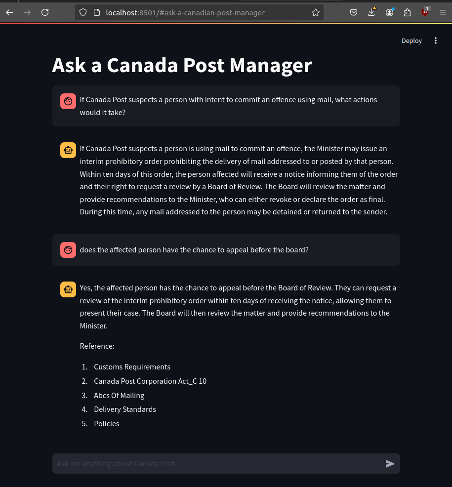

# "Ask a Canada Post Manager" Chatbot

## Overview

"Ask a Canada Post Manager" Chatbot is a tool designed to assist managers in answering questions related to Canada Post, particularly based on the official postal services information available on the Canada Post website ([link here](https://www.canadapost-postescanada.ca/cpc/en/support/postal-services-information.page)). This chatbot enables quick, efficient responses to both internal and external inquiries and provides source references for further details.

The chatbot leverages 25 PDF-based Canada Post guides as its primary data source ([refer to this folder](/1_knowledge_base/)). By integrating retrieval-augmented generation (RAG) using OpenAI's Large Language Models (LLMs) and DeepLake as a vector database, the chatbot retrieves relevant information from the guides to answer questions concisely and accurately.


---

## Key Features

- **Contextual Answering**: Provides concise, context-aware answers to queries regarding Canada Post, focusing only on information from official postal guides.
- **Source Reference Display**: Lists unique reference sources for each response, allowing users to follow up with additional details if needed.
- **User History**: Maintains chat history, enabling seamless continuity in multi-step question-answer interactions.
- **Efficient Retrieval System**: Optimized to retrieve the closest document chunks using cosine similarity, fetching the five most relevant sections.

---

## Technologies Used

- **Streamlit**: Interactive web app framework to host and manage the chatbot interface.
- **OpenAI's GPT Model**: Utilized for generating responses based on retrieved document chunks.
- **DeepLake Vector Database**: Stores vector embeddings of PDF content for quick and accurate retrieval.
- **Activeloop**: Account setup for DeepLake dataset storage and retrieval operations.
- **Python Libraries**: `dotenv` for API key management, `ChatOpenAI` and `OpenAIEmbeddings` for OpenAI LLM integration, and `DeepLake` for embedding database setup.

---

## Usage

### 1. Clone the repository
```bash
git clone https://github.com/yourusername/canada-post-chatbot.git
cd canada-post-chatbot
```

### 2. Install dependencies
```bash
pip install -r requirements.txt
```
### 3. Create a .env file with your API keys for OpenAI and DeepLake


```bash
# Replace YOUR_OPENAI_API_KEY and YOUR_DEEPLAKE_API_KEY with actual keys
OPENAI_API_KEY= YOUR_OPENAI_API_KEY
ACTIVELOOP_TOKEN= YOUR_DEEPLAKE_API_KEY

```
### 4. Run load_doc.ipynb to load the PDFs onto Deeplake

- Remember to update the dataset path to your own Deeplake database.

### 5. Run the Streamlit app
```bash
streamlit run chatbot.py
```
